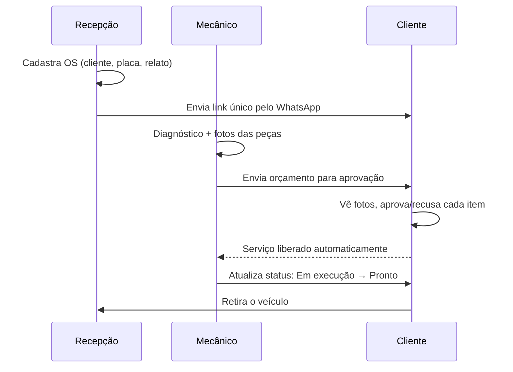
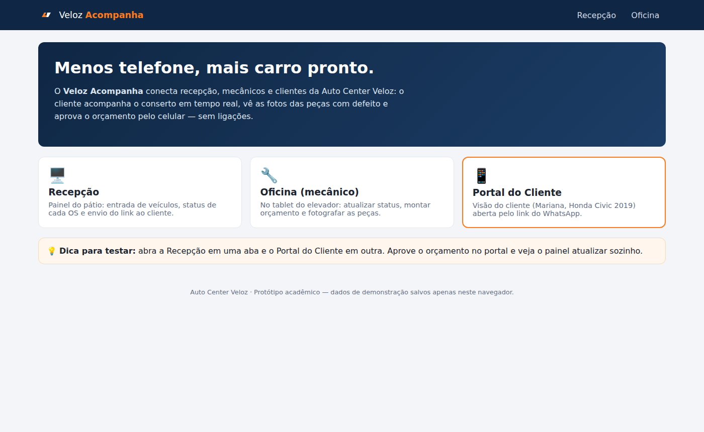
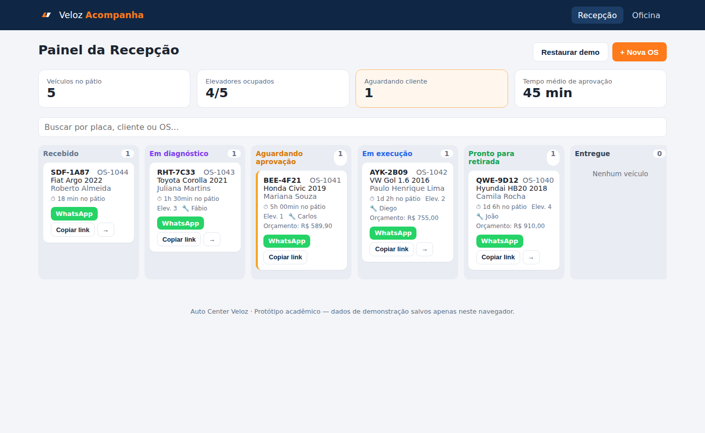
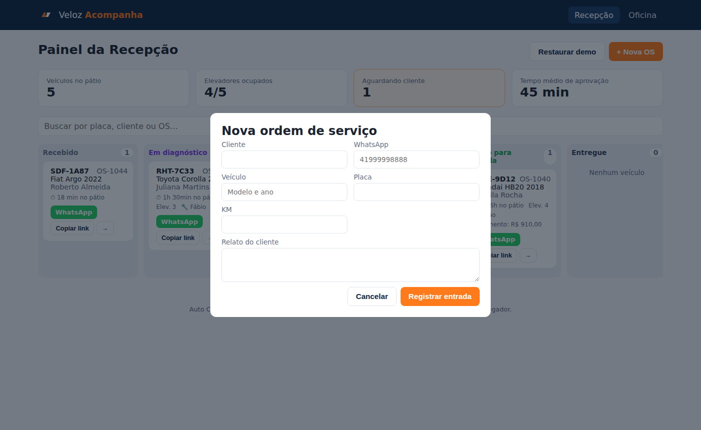
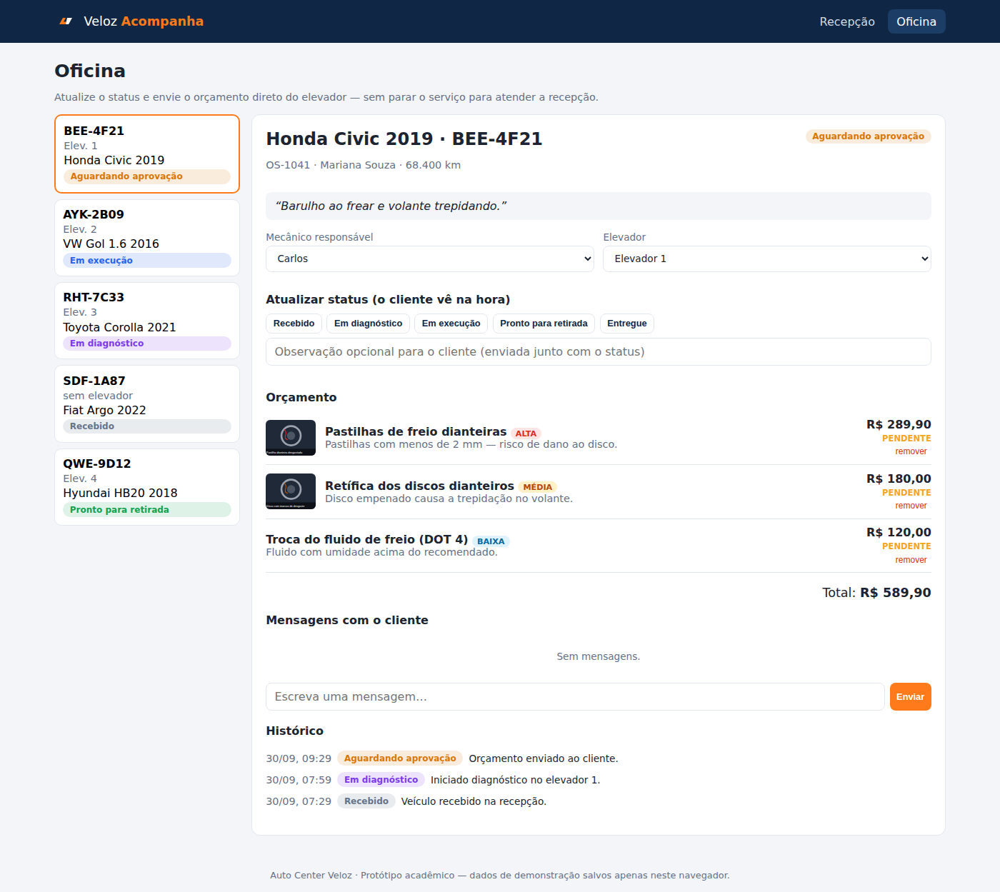
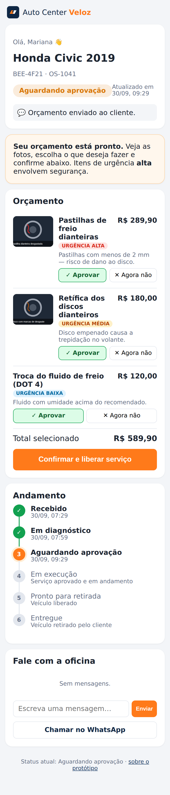
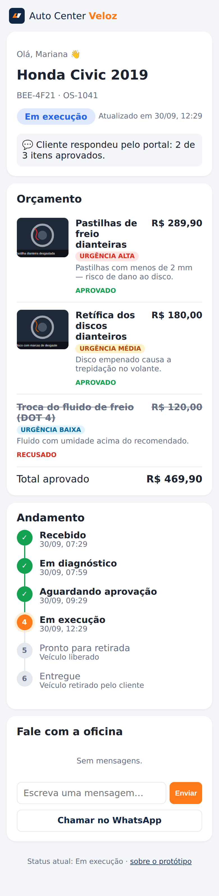
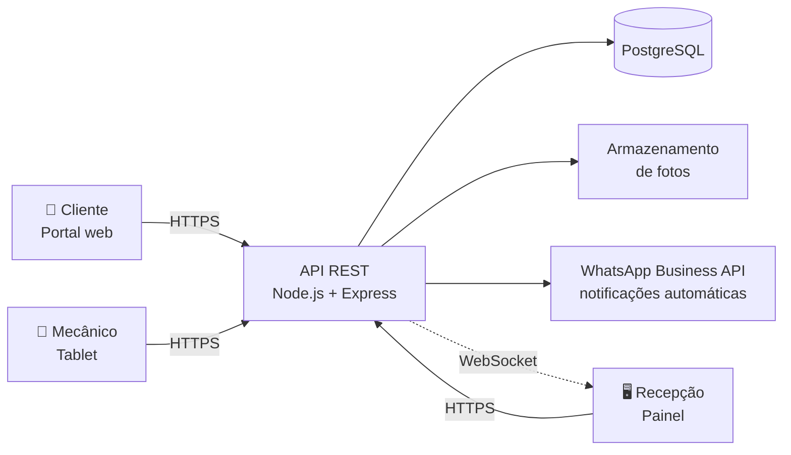

# Veloz Acompanha - Auto Center Veloz

> Web app para **acompanhar o conserto em tempo real** e **aprovar orçamentos pelo celular**, com fotos das peças com defeito, feito para a oficina **Auto Center Veloz**.


 **Demo publicada:** https://RafaelPilato.github.io/autocenter-veloz/

---

## Sumário

1. [Briefing do problema](#-briefing-do-problema)
2. [Solução proposta](#-solução-proposta)
3. [Justificativa da escolha: por que um Web App?](#-justificativa-da-escolha-por-que-um-web-app)
4. [Protótipo e telas](#-protótipo-e-telas)
5. [Arquitetura](#-arquitetura)
6. [Como executar](#-como-executar)
7. [Segurança de credenciais](#-segurança-de-credenciais)
8. [Próximos passos](#-próximos-passos)
9. [Licença](#-licença)

---

## Briefing do problema

A **Auto Center Veloz** é uma oficina mecânica de manutenção preventiva e corretiva de veículos de passeio, liderada pelos sócios **Eduardo** (gerente de oficina) e **Henrique** (financeiro e compras). Tem **5 elevadores**, **6 mecânicos** e **2 recepcionistas**, e é reconhecida pela qualidade técnica.

**Processo atual:** a recepção cadastra o veículo e imprime o orçamento na entrada; autorizações de troca de peças são pedidas **por telefone**.

**Dores identificadas:**

| Dor | Consequência |
|---|---|
| Telefone da recepção não para de tocar com clientes perguntando o status | Recepção sobrecarregada |
| Mecânicos param o serviço para responder à recepção | Perda de produtividade no elevador |
| Clientes pedem fotos das peças com defeito | Troca de mensagens manual e lenta |
| Clientes demoram horas para aprovar orçamentos | **Pátio lotado** de carros parados esperando resposta |
| Falha de comunicação | Risco de **avaliações negativas** na internet |

**Oportunidade:** as concessionárias oferecem relatórios digitais, mas cobram caro; as oficinas pequenas são informais. A Veloz pode unir sua **confiança técnica** a um **canal de comunicação transparente e rápido**, reduzindo o tempo de permanência do veículo no pátio.

---

## Solução proposta

O **Veloz Acompanha** é um web app com três visões, uma para cada perfil envolvido:

| Perfil | Onde usa | O que resolve |
|---|---|---|
| **Recepção** | Computador do balcão | Painel *kanban* do pátio com todas as OS por etapa, indicadores (veículos no pátio, elevadores ocupados, carros aguardando cliente, tempo médio de aprovação), cadastro de nova OS e envio do link de acompanhamento pelo **WhatsApp** com um clique. |
| **Oficina (mecânico)** | Tablet/celular no elevador | Atualiza o status do carro, monta o orçamento item a item, **fotografa a peça com defeito** direto pela câmera e envia o orçamento para aprovação, sem ir até a recepção. |
| **Cliente** | Celular, pelo link recebido | Vê a linha do tempo do conserto, as **fotos e a explicação** de cada item, com nível de urgência (segurança × pode aguardar), **aprova ou recusa item a item** e libera o serviço na hora. Também pode mandar mensagem para a oficina. |

### Fluxo



### Como cada dor é resolvida

- **"Meu carro está pronto?"** → o cliente consulta sozinho a linha do tempo, atualizada pelo mecânico em tempo real. Menos ligações.
- **"Manda foto da peça"** → a foto já vem junto de cada item do orçamento, com explicação em linguagem simples.
- **Aprovação demorada** → um toque no celular por item. O status muda para *Em execução* automaticamente, sem ligação.
- **Mecânico interrompido** → ele registra tudo no tablet do elevador; a recepção vê no painel.
- **Pátio lotado** → o indicador *Aguardando cliente* e o *tempo médio de aprovação* mostram onde está o gargalo; cards aguardando resposta ficam destacados.
- **Avaliações negativas** → transparência (fotos, justificativa, urgência) gera confiança, no nível de relatório de concessionária.

---

## Justificativa da escolha: por que um Web App?

Foram avaliadas três alternativas:

| Critério | App móvel nativo | Site institucional | **Web App responsivo (escolhido)** |
|---|---|---|---|
| Cliente precisa instalar algo? | Sim (barreira alta para um uso eventual) | Não | **Não: abre pelo link do WhatsApp** |
| Resolve status + aprovação? | Sim | Não, só divulga a empresa | **Sim** |
| Atende recepção (PC) e mecânico (tablet)? | Parcialmente | Não | **Sim, um único sistema responsivo** |
| Custo de desenvolvimento e manutenção | Alto (lojas, 2 plataformas) | Baixo | **Médio, uma base de código** |
| Tempo até entrar em uso | Longo | Curto | **Curto** |

**Conclusão:** o cliente de oficina usa o sistema poucas vezes por ano; exigir a instalação de um app derrubaria a adesão. Um **web app acessado por link** funciona em qualquer celular, é enviado pelo canal que o cliente já usa (WhatsApp) e, com o mesmo código, atende o **painel da recepção** (desktop) e o **tablet do mecânico**. É a solução com melhor relação entre impacto na dor e custo para a oficina.

---

## Protótipo e telas

> Todas as telas abaixo são do protótipo funcional (disponível na demo publicada).

### Página inicial (escolha de perfil)


### Painel da Recepção (kanban do pátio + indicadores)


### Cadastro de nova OS


### Tela da Oficina (mecânico no elevador)


### Portal do Cliente (celular)

| Orçamento com fotos e aprovação por item | Após aprovação |
|---|---|
|  |  |

### Identidade visual

| Elemento | Definição |
|---|---|
| Azul-marinho `#0f2744` | Confiança e seriedade técnica (cor principal) |
| Laranja `#ff7a1a` | Agilidade ("Veloz"), usado nas ações principais |
| Cores de status | Cada etapa tem uma cor fixa em todas as telas |
| Urgência | Vermelho = segurança · Amarelo = recomendado · Azul = pode aguardar |
| Portal do cliente | *Mobile-first*, botões grandes, linguagem simples |

---

## Arquitetura

### Protótipo (esta versão)

```
autocenter-veloz/
├── .github/workflows/deploy.yml   # CI/CD: build e publicação no GitHub Pages
├── docs/screenshots/              # Telas do protótipo usadas neste README
├── public/favicon.svg
├── src/
│   ├── components/                # Componentes reutilizáveis (Header, Timeline, Mensagens...)
│   ├── data/store.js              # Camada de dados (simula a API)
│   ├── pages/                     # Home, Recepcao, Oficina, PortalCliente
│   ├── hooks.js                   # Roteamento por hash + estado reativo
│   ├── App.jsx
│   ├── main.jsx
│   └── styles.css
├── .env.example                   # Modelo de variáveis (sem valores reais)
├── .gitignore
├── LICENSE
├── index.html
├── package.json
└── vite.config.js
```

| Camada | Tecnologia | Motivo |
|---|---|---|
| Interface | **React 18** | Componentização das três visões com o mesmo código |
| Build | **Vite 5** | Build rápido e simples; gera arquivos estáticos |
| Rotas | Hash router próprio (`#/recepcao`, `#/oficina`, `#/os/:token`) | Funciona no GitHub Pages sem configuração de servidor |
| Dados | `localStorage` + eventos de sincronização | Simula o backend; as abas se atualizam em tempo real |
| Fotos | API de arquivos do navegador + compressão em `<canvas>` | Abre a câmera do celular/tablet e reduz o tamanho da imagem |
| WhatsApp | Links `wa.me` | Envio do link ao cliente **sem precisar de chave de API** |
| Deploy | **GitHub Actions + GitHub Pages** | Publicação automática a cada `push` na `main` |


### Arquitetura alvo (produção)



Na versão de produção, `src/data/store.js` seria trocado por chamadas à API REST, mantendo as mesmas funções (`criarOrdem`, `mudarStatus`, `responderOrcamento`...). O link do cliente usa um **token aleatório** por OS, e não o número sequencial, para que ninguém consiga ver a OS de outra pessoa trocando o número na URL.

---

## ▶️ Como executar

### Pré-requisitos
- [Node.js](https://nodejs.org/) 18 ou superior
- npm (vem com o Node)

### Publicação (GitHub Pages)

- Cada `push` na branch `main` gera o build e publica em `https://RafaelPilato.github.io/autocenter-veloz/`.

---

## 🔒 Segurança de credenciais

- **Nenhuma** senha, token ou chave de API existe no código nem no histórico de commits.
- O protótipo foi projetado para **não precisar de credenciais**: o envio pelo WhatsApp usa links públicos `wa.me`.
- O arquivo `.env` (e variações) está no `.gitignore`. Apenas o `.env.example`, **sem valores reais**, é versionado como modelo.
- Na versão de produção, segredos (conexão com banco, token do WhatsApp Business) ficariam em variáveis de ambiente do servidor ou em **GitHub Secrets**, nunca no front-end.

---

## Licença

Distribuído sob a licença **MIT**. Veja o arquivo [LICENSE](LICENSE).

---

Desenvolvido por **Rafael Pilato** · Disciplina de Design Profissional: Produção de Portfólio & Desenvolvimento Empresarial · Prof. Sedenilso Antonio Machado · 2026